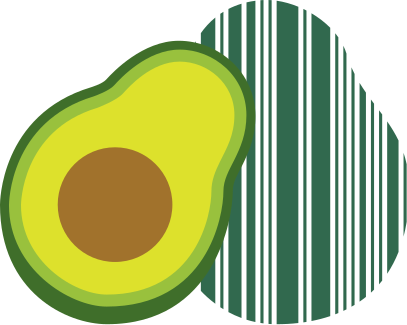

# 


> 시각 장애인을 위한 AI 기반 음성 안내 바코드 스캐너

> HearCode는 한국산업기술평가관리원(KEIT)이 주최한 **『AI 라이프 솔루션 챌린지』** 공모전을 위해 개발된 웹 애플리케이션입니다. 선정된 AI 라이프 아이디어인 "들리는 바코드"를 실제 구현하여, 시각 장애인이 일상생활에서 제품 정보를 쉽게 확인할 수 있도록 돕습니다.

[🔗 배포 주소 바로가기]

##  팀 소개

> 안녕하세요, HearCode입니다!👋

### 👥 팀원 소개 및 역할

| 팀원   | 역할       | 주요 담당    | GitHub                                       |
| ------ | ---------- | ------------ | -------------------------------------------- |
| 안동원 | PM, QA, FE | 바코드 스캔  | [@dongwonAhn](https://github.com/dongwonAhn) |
| 우혜리 | PL, QA, FE | 식품영양 api | [@WUHYERI](https://github.com/WUHYERI)       |
| 석정일 | PL, QA, FE | history      | [@but212](https://github.com/but212)         |

### ✨ 팀원별 주요 기여

<details>
<summary>펼쳐보기</summary>

#### 👩‍💻 안동원

- 기획 및 일정 관리
- 공통 컴포넌트 제작 (네비게이션 바)
- 바코드 스캔 페이지 구현
- 문서 관리 및 README 제작

#### 👨‍💻 우혜리

- 기획 및 UI 디자인
- 공통 컴포넌트 제작 (모달 다이얼로그)
- 식품 api 모달 구현
- 기능 QA 및 품질 점검

#### 👩‍💻 석정일

- 프로젝트 초기 세팅 및 구조 설계
- 공통 컴포넌트 제작 (버튼)
- 랜딩, history 페이지 구현
- DB 점검 및 CRUD 테스트

</details>

---

##  프로젝트 소개

### 📅 프로젝트 진행 기간

- 2025.11.03 ~ 2025.12.02

### 💡 기획 의도

**1. 문제 인식**

- 시각장애인은 마트나 편의점에서 **제품 정보 확인이 불가능**
- 바코드 위치를 찾지 못해 **독립적인 제품 선택 불가**
- 알레르기 위험 및 **식품 선택권 박탈**

**2. 원인 분석**

- 기존 스캐너는 **위치 안내 기능 부재**
- 제품 정보의 **시각 중심 제공**
- 접근성을 고려한 **보조 기술 부족**

**3. 해결 방향**

- **AI 기반 실시간 위치 추적** 및 음성 가이드
- **식약처 API 연동**으로 상세 정보 제공

> 이러한 문제의식을 바탕으로 시각장애인이 독립적으로 제품 정보를 확인할 수 있는 AI 기반 음성 안내 바코드 스캐너 HearCode(들리는 바코드)를 구현하였습니다.

### ✨ 주요 기능

| 기능                 | 설명                                                                                                                                   |
| -------------------- | -------------------------------------------------------------------------------------------------------------------------------------- |
| **바코드 스캔**      | Quagga.js 기반 실시간 바코드 위치 추적 · html5-qrcode로 정확한 디코딩 · "왼쪽으로", "위로" 등 방향 음성 안내 · 햅틱 피드백 제공        |
| **음성 가이드**      | TTS 기반 한국어 음성 안내 · 바코드 위치 실시간 안내 · 제품 정보 자동 읽어주기 · 스캔 진행 상황 안내                                    |
| **제품 정보 조회**   | 식품의약품안전처 푸드QR API 연동 · 제품명, 제조사, 용량 정보 · 원재료 및 영양 성분 정보 · 알레르기 유발 물질 정보 · HACCP 등 인증 정보 |
| **스캔 히스토리**    | IndexedDB 기반 로컬 저장 · 최근 스캔 제품 목록 조회 · 개별 항목 삭제 · 제품 정보 재확인 가능                                           |
| **로컬 데이터 저장** | IndexedDB로 스캔 히스토리 저장 · localStorage로 최근 스캔 결과 캐싱 · 이전에 조회한 제품은 재조회 가능                                 |
| **카메라 전환**      | 전면/후면 카메라 자유 전환 · 스캔 중에도 전환 가능                                                                                     |
| **접근성 기능**      | 음성 안내 및 햅틱 피드백 · aria-label 적용                                                                                             |

### 🛠️ 기술 스택

| 분류             | 기술                                                                                                                                                                                                                                                                                                                                                                                                                    |
| ---------------- | ----------------------------------------------------------------------------------------------------------------------------------------------------------------------------------------------------------------------------------------------------------------------------------------------------------------------------------------------------------------------------------------------------------------------- |
| 프론트엔드       |                                                                                 |
| 상태 관리 도구   |                                                                                                                                                                                                                                                                                                                 |
| 패키지 매니저    |                                                                                                                                                                                                                                                                                                                         |
| 배포             |                                                                                                                                                                                                                                                                                                                   |
| 버전 관리 & 협업 |     |
| 디자인           |                                                                                                                                                                                                                                                                                                                     |

---

##  프로젝트 구조 및 실행

### 프로젝트 구조

```bash
project/
├── public                 / # 정적 파일 (이미지)
├── src
│ │
│ ├── app
│ │ ├── _components
│ │ ├── _constants
│ │ ├── history
│ │ ├── scan
│ │ ├── layout.tsx
│ │ ├── page.tsx
│ │ └── Provider.tsx
│ │
│ ├── components           / # 재사용 가능한 UI 컴포넌트
│ │ ├── _constants
│ │ ├── MainButton.tsx
│ │ ├── NavigationBar.tsx
│ │ └── Popover.tsx
│ │
│ ├── db
│ ├── fonts
│ ├── store                / # 상태 관리 관련 (Zustand)
│ ├── styles               / # 컬러 설정값 정의
│ ├── types
│ └── utils                / # 유틸 함수
│
├── .env.local             / # 환경 변수 설정 (API 키)
├── .gitignore
├── .prettierignore
├── .prettierrc
├── bun.lock
├── eslint.config.mjs
├── next-env.d.ts
├── next.config.ts
├── package.json
├── postcss.config.mjs
├── README.md              / # 프로젝트 개요 및 실행 방법 문서
└── tsconfig.json
```

### 🔎 실행 방법

```bash
# 1. 프로젝트 클론 (폴더 이름을 'HearCode'로 지정)
git clone https://github.com/ai-life-solution.git HearCode
```

```bash
# 2. 프로젝트 폴더로 이동
cd HearCode
```

```bash
# 3. 패키지 설치
bun install
```

```bash
# 4. .env.local 파일에 환경 변수 설정
FOOD_QR_URL
FOOD_QR_API_KEY
```

```bash
# 5. 개발 서버 실행
bun dev
```

#### ⚙️ 기타 명령어

| 목적           | 명령어       | 설명              |
| -------------- | ------------ | ----------------- |
| 코드 품질 검사 | `bun lint`   | 린트 검사         |
| 코드 포맷팅    | `bun format` | 자동 포맷         |
| 프로덕션 빌드  | `bun prod`   | Next.js 빌드 생성 |

---

##  서비스 흐름도 (Flow Chart)

> 전체 사용자의 흐름과 주요 페이지 간의 흐름을 플로우 차트로 시각화했습니다.


---


> HearCode는 보이지 않는 정보를 들려주고, 들리지 않던 목소리에 귀 기울입니다.
