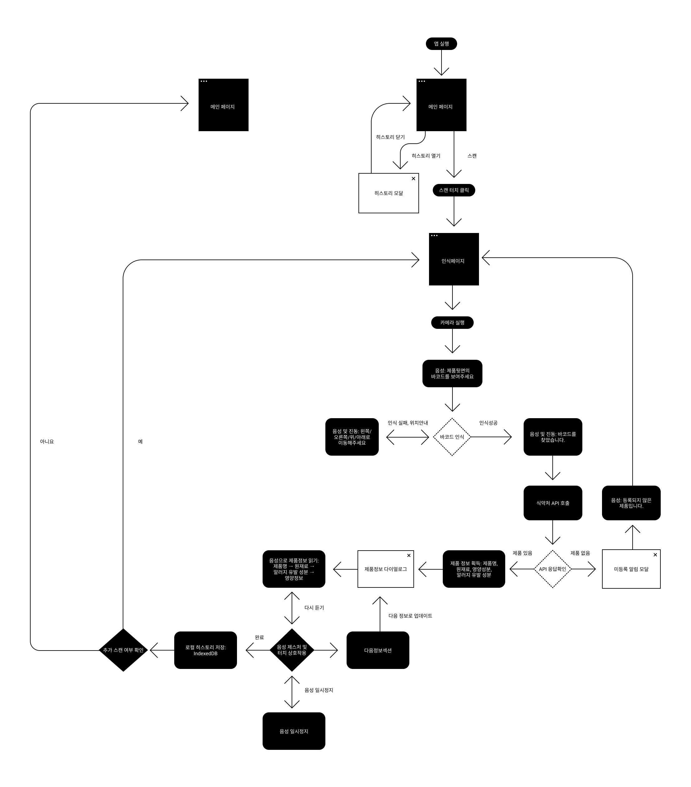

# 

> 시각 장애인을 위한 AI 기반 음성 안내 바코드 스캐너
> HearCode는 한국산업기술평가관리원(KEIT)이 주최한 **『AI 라이프 솔루션 챌린지』** 공모전을 위해 개발된 웹 애플리케이션입니다. 선정된 AI 라이프 아이디어인 "들리는 바코드"를 실제 구현하여, 시각 장애인이 일상생활에서 제품 정보를 쉽게 확인할 수 있도록 돕습니다.
> [Food QR API](https://data.mfds.go.kr/OPCAA01P01?srvcNm=FoodQrInfoService&callBackFn=fnPopupCallback)에 등록된 제품만 가능합니다.

[배포 주소 바로가기](https://hearcode.vercel.app/)

## 팀 소개

> 안녕하세요, HearCode입니다!

### 팀원 소개 및 역할

| 팀원   | 역할       | 주요 담당             | GitHub                                       |
| ------ | ---------- | --------------------- | -------------------------------------------- |
| 안동원 | PM, QA, FE | 바코드 스캔           | [@dongwonAhn](https://github.com/dongwonAhn) |
| 우혜리 | PL, QA, FE | 식품영양 api          | [@WUHYERI](https://github.com/WUHYERI)       |
| 석정일 | PL, QA, FE | history, AI 서버 액션 | [@but212](https://github.com/but212)         |

### 팀원별 주요 기여

#### 안동원

- 기획 및 일정 관리
- 공통 컴포넌트 제작 (네비게이션 바)
- 바코드 스캔 페이지 구현
- 문서 관리 및 README 제작

#### 우혜리

- 기획 및 UI 디자인
- 공통 컴포넌트 제작 (모달 다이얼로그)
- 식품 api 모달 구현
- 기능 QA 및 품질 점검

#### 석정일

- 프로젝트 초기 세팅 및 구조 설계
- 랜딩, history 페이지 구현
- DB 점검 및 CRUD 테스트
- AI api 연결 및 서버액션 추가

---

## 프로젝트 소개

### 프로젝트 진행 기간

- 2025.11.03 ~ 2025.12.02

### 기획 의도

#### **1. 문제 인식**

- 시각장애인은 마트나 편의점에서 **제품 정보 확인이 불가능**
- 바코드 위치를 찾지 못해 **독립적인 제품 선택 불가**
- 알레르기 위험 및 **식품 선택권 박탈**

#### **2. 원인 분석**

- 기존 스캐너는 **위치 안내 기능 부재**
- 제품 정보의 **시각 중심 제공**
- 접근성을 고려한 **보조 기술 부족**

#### **3. 해결 방향**

- **AI 기반 실시간 위치 추적** 및 음성 가이드
- **식약처 API 연동**으로 상세 정보 제공

> 이러한 문제의식을 바탕으로 시각장애인이 독립적으로 제품 정보를 확인할 수 있는 AI 기반 음성 안내 바코드 스캐너 HearCode(들리는 바코드)를 구현하였습니다.

### 주요 기능

| 기능               | 설명                                                                                                                                 |
| ------------------ | ------------------------------------------------------------------------------------------------------------------------------------ |
| **바코드 스캔**    | HTML5-QRCode 기반 실시간 바코드 디코딩 · 카메라 전환 지원 · 스캔 진행 상황 시각적 피드백 · 햅틱 피드백 제공                          |
| **음성 가이드**    | Web Speech API 기반 한국어 TTS · 스캔 진행 상황 음성 안내 · 제품 정보 자동 읽어주기 · AI 요약 정보 음성 제공                         |
| **제품 정보 조회** | 식품의약품안전처 푸드QR API 연동 · 5개 API 병렬 호출(기본/원재료/알러지/영양/인증) · 제품명, 제조사, 용량 정보 · 원재료 및 영양 성분 |
| **AI 기반 요약**   | OpenRouter API 연동(Grok-4.1-fast) · 식품 정보 200자 이내 요약 · 알레르기 및 영양 정보 쉽게 설명                                     |
| **스캔 히스토리**  | IndexedDB 기반 로컬 저장 · 최근 스캔 제품 목록 조회 · 개별 항목 삭제 · 제품 정보 재확인 가능                                         |
| **데이터 캐싱**    | localStorage로 최근 스캔 결과 캐싱 · Zustand persist로 상태 저장 · 이전에 조회한 제품은 재조회 가능                                  |
| **카메라 전환**    | 전면/후면 카메라 자유 전환 · 스캔 중에도 전환 가능                                                                                   |
| **접근성 기능**    | 음성 안내 및 햅틱 피드백 · aria-label 적용 · 키보드 네비게이션 지원                                                                  |

### 기술 스택

| 분류             | 기술                                                                                                                                                                                                                                                                                                                                                                                                                                                  |
| ---------------- | ----------------------------------------------------------------------------------------------------------------------------------------------------------------------------------------------------------------------------------------------------------------------------------------------------------------------------------------------------------------------------------------------------------------------------------------------------- |
| 프론트엔드       |     |
| 상태 관리 도구   |                                                                                                                                                                                                                    |
| 바코드 스캔      |                                                                                                                                                                                                                                                                                                                                      |
| 데이터 저장      |                                                                                                                                                                                                                                                                                                                                        |
| AI               |                                                                                                                                                                                                                  |
| 패키지 매니저    |                                                                                                                                                                                                                                                                                                                                                           |
| 배포             |                                                                                                                                                                                                                                                                                                                                                  |
| 버전 관리 & 협업 |                                         |
| 디자인           |                                                                                                                                                                                                                                                                                                                                                     |

---

## 프로젝트 구조 및 실행

### 프로젝트 구조

```bash
project/
├── public/                    # 정적 파일 (이미지, SVG 로고)
├── src/
│   ├── actions/               # 서버 액션 (AI 챗봇 API)
│   ├── app/
│   │   ├── _components/       # 앱 전용 컴포넌트
│   │   ├── _constants/        # 앱 전용 상수
│   │   ├── api/               # API 라우트 (푸드 QR 프록시)
│   │   ├── history/           # 스캔 히스토리 페이지
│   │   ├── scan/              # 바코드 스캔 페이지
│   │   ├── ai-test/           # AI 기능 테스트 페이지
│   │   ├── layout.tsx         # 루트 레이아웃
│   │   ├── page.tsx           # 랜딩 페이지
│   │   └── Provider.tsx       # Query Client Provider
│   ├── components/            # 재사용 가능한 UI 컴포넌트
│   │   ├── _constants/        # 컴포넌트 전용 상수
│   │   ├── MainButton.tsx     # 메인 버튼 컴포넌트
│   │   ├── NavigationBar.tsx  # 네비게이션 바
│   │   ├── Popover.tsx        # 팝오버/모달 다이얼로그
│   │   ├── scan-result/       # 스캔 결과 관련 컴포넌트
│   │   └── scan-result-modal/ # 스캔 결과 모달 컴포넌트
│   ├── db/                    # IndexedDB 관련 (히스토리 저장)
│   ├── fonts/                 # 로컬 폰트 파일
│   ├── hooks/                 # 커스텀 React 훅
│   ├── libs/                  # 외부 라이브러리 연동
│   │   └── api/               # API 클라이언트 (푸드 QR)
│   ├── store/                 # 상태 관리 (Zustand)
│   │   ├── scanResultStore.tsx    # 스캔 결과 상태
│   │   └── useFoodsHistoryStore.ts # 히스토리 상태
│   ├── styles/                # 전역 스타일 및 테마
│   ├── types/                 # TypeScript 타입 정의
│   │   ├── FoodData.ts        # 푸드 데이터 타입
│   │   └── FoodItem.ts        # 식품 아이템 타입
│   └── utils/                 # 유틸리티 함수
│       ├── foodQrTransformer.ts # API 데이터 변환
│       ├── speechSynthesis.ts   # TTS 음성 합성
│       └── ...                 # 기타 유틸리티
├── docs/                      # 프로젝트 문서
│   ├── conventions.md         # 코딩 컨벤션
│   ├── user-flow.md           # 사용자 흐름 문서
│   └── user-flow.png          # 플로우 차트 이미지
├── .env.local                 # 환경 변수 설정 (API 키)
├── .env                       # 환경 변수 템플릿
├── .gitignore
├── .prettierignore
├── .prettierrc
├── bun.lock                   # Bun 패키지 lock 파일
├── eslint.config.mjs          # ESLint 설정
├── next-env.d.ts
├── next.config.ts             # Next.js 설정
├── package.json               # 프로젝트 의존성 및 스크립트
├── postcss.config.js          # PostCSS 설정
├── README.md                  # 프로젝트 개요 및 실행 방법 문서
└── tsconfig.json              # TypeScript 설정
```

### 실행 방법

```bash
# 1. 프로젝트 클론 (폴더 이름을 'HearCode'로 지정)
git clone https://github.com/ai-life-solution.git HearCode
```

```bash
# 2. 프로젝트 폴더로 이동
cd HearCode
```

```bash
# 3. 패키지 설치
bun install
```

```bash
# 4. .env.local 파일에 환경 변수 설정
# 푸드 QR API
FOOD_QR_URL=https://foodqr.kr/openapi/service
FOOD_QR_API_KEY=your_api_key_here

# OpenRouter API (AI 요약 기능)
OPENROUTER_API_KEY=your_openrouter_api_key_here
```

```bash
# 5. 개발 서버 실행
bun dev
```

#### 기타 명령어

| 목적           | 명령어          | 설명                 |
| -------------- | --------------- | -------------------- |
| 코드 품질 검사 | `bun lint`      | ESLint 검사          |
| 코드 포맷팅    | `bun format`    | Prettier 자동 포맷   |
| 타입 검사      | `bun typecheck` | TypeScript 타입 체크 |
| 프로덕션 빌드  | `bun prod`      | Next.js 빌드 및 시작 |

### 문제 해결 가이드

#### 카메라 관련 문제

- **카메라 권한이 거부된 경우**: 브라우저 설정에서 카메라 권한을 허용해주세요
- **카메라가 작동하지 않을 경우**: HTTPS 환경에서만 카메라 API가 동작합니다
- **후면 카메라로 전환 안될 때**: 일부 기기는 후면 카메라를 지원하지 않을 수 있습니다

#### API 관련 문제

- **푸드 QR API 응답 없음**: 바코드 번호가 정확한지 확인하고, 인터넷 연결 상태를 점검하세요
- **AI 요약 기능 오류**: OPENROUTER_API_KEY가 올바르게 설정되었는지 확인하세요

#### 데이터 저장 관련

- **히스토리가 저장되지 않을 때**: 브라우저의 IndexedDB 지원 여부를 확인하세요
- **캐시된 데이터가 오래될 경우**: 브라우저 개발자 도구에서 로컬 스토리지를 초기화할 수 있습니다

---

## 서비스 흐름도 (Flow Chart)

> 전체 사용자의 흐름과 주요 페이지 간의 흐름을 플로우 차트로 시각화했습니다.



---


> HearCode는 보이지 않는 정보를 들려주고, 들리지 않던 목소리에 귀 기울입니다.
